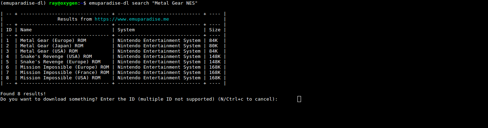

# Emuparadise-dl

emuparadise-dl is a (maybe) helpful script to search and retrieve roms from the top rom-hosting websites out there.

It was originally built because I wanted to access Emuparadise's huge database in a faster (and less javascriptish) way, but then I decided to extend the support to more sites. 

## Installation

pip3 install emuparadise-dl

## Usage

Basic Usage

```bash
emuparadise-dl "Metal Gear Solid"
```



It will search using the search function provided by the site and It will report back the found results in a tabular format. You will be prompted to insert the ID (first column) of the rom to retrieve (or just type N to abort).


To know the list of supported backend as well as a full set of options just type

```bash
emuparadise-dl -h
```

By default it uses emuparadise.me as backend, it is possible to use a different one with ```emuparadise-dl -b <backend>``` or to search on all the avaliable backend at once with ```emuparadise-dl --all``` (WARNING: please note that the output could be very long for common roms)


## FAQ

Q: I'm the owner of one of those backend supported by emuparadise-dl and I want you to stop supporting my site.

A: Ok, I sent you an email, since you didn't reply I supposed you don't mind. However, send me an email and I'll remove support from future releases

Q: Is this a scraper?

A: NO, it is a TUI search engine for roms (actually the search function is called on the backend), all the content is hosted on the sites, so you sould support the backend you are using

Q: The name sounds familiar...

A: Yeah, I took inspiration from youtube-dl

Q: OMG, your parsing-fu skills sucks, I bet it's possible to rewrite all those parsing in 2 lines

A: Pull request or GTFO
